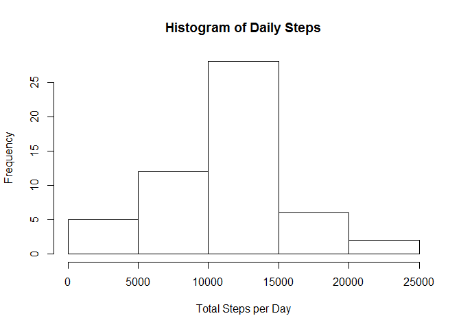
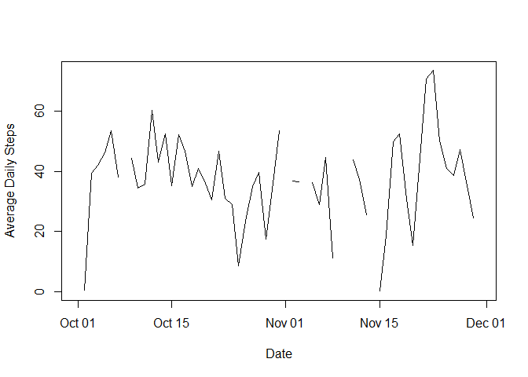
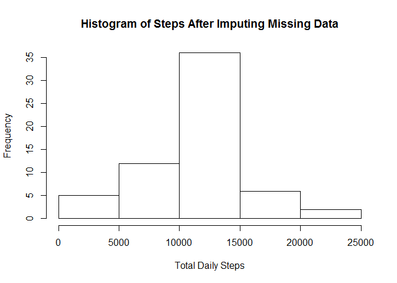
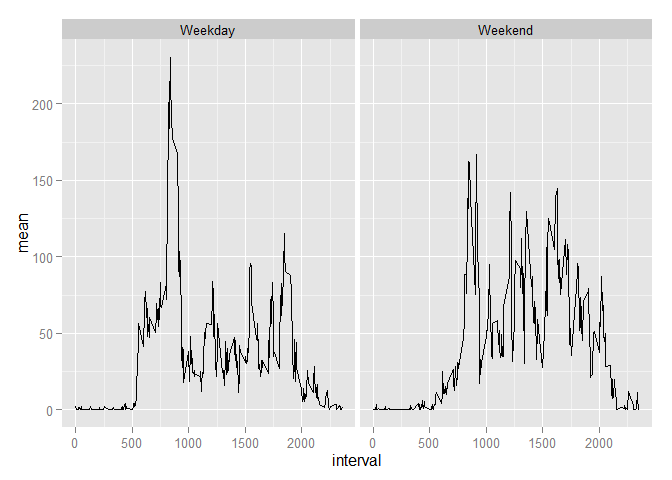

# Reproducible Research Project 1
1. LOADING AND PREPROCESSING DATA

The required R packages are read into R:


```r
library(plyr)
library(dplyr)
```

```
## 
## Attaching package: 'dplyr'
## 
## The following objects are masked from 'package:plyr':
## 
##     arrange, count, desc, failwith, id, mutate, rename, summarise,
##     summarize
## 
## The following objects are masked from 'package:stats':
## 
##     filter, lag
## 
## The following objects are masked from 'package:base':
## 
##     intersect, setdiff, setequal, union
```

```r
library(ggplot2)
```

The data can be found in a zipped file at: https://d396qusza40orc.cloudfront.net/repdata%2Fdata%2Factivity.zip
The data should be extracted and saved in the R working directory as activity.csv.

The raw data are then read into R and saved as "data"


```r
data <- read.csv("activity.csv")
```

The data set is then process to a useful format.


```r
data<-mutate(data,day=weekdays(as.Date(date,'%Y-%m-%d')))
data<-mutate(data,v1=as.numeric(steps))

mydate<-data$date
mydate<-as.Date(mydate, format = "%Y-%m-%d")
data<-cbind(data,mydate)

data<-select(data,v1,mydate,interval,day)
data<-rename(data,steps=v1)
data<-rename(data,date=mydate)
```

2. TOTAL, MEAN AND MEDIAN STEPS FOR EACH DAY

The daily totals,and averages and median for each day's 5 minute interval are calculated:


```r
day.tot <- ddply(data, c("date"), summarise,
                      sum  = sum(steps))

day.mean <- ddply(data, c("date"), summarise,
                 mean  = mean(steps))

day.median <-ddply(data, c("date"), summarise,
                   median  = median(steps))

tot.mean.median<-cbind(day.tot,day.mean$mean,day.median$median)

tot.mean.median
```

```
##          date   sum day.mean$mean day.median$median
## 1  2012-10-01    NA            NA                NA
## 2  2012-10-02   126     0.4375000                 0
## 3  2012-10-03 11352    39.4166667                 0
## 4  2012-10-04 12116    42.0694444                 0
## 5  2012-10-05 13294    46.1597222                 0
## 6  2012-10-06 15420    53.5416667                 0
## 7  2012-10-07 11015    38.2465278                 0
## 8  2012-10-08    NA            NA                NA
## 9  2012-10-09 12811    44.4826389                 0
## 10 2012-10-10  9900    34.3750000                 0
## 11 2012-10-11 10304    35.7777778                 0
## 12 2012-10-12 17382    60.3541667                 0
## 13 2012-10-13 12426    43.1458333                 0
## 14 2012-10-14 15098    52.4236111                 0
## 15 2012-10-15 10139    35.2048611                 0
## 16 2012-10-16 15084    52.3750000                 0
## 17 2012-10-17 13452    46.7083333                 0
## 18 2012-10-18 10056    34.9166667                 0
## 19 2012-10-19 11829    41.0729167                 0
## 20 2012-10-20 10395    36.0937500                 0
## 21 2012-10-21  8821    30.6284722                 0
## 22 2012-10-22 13460    46.7361111                 0
## 23 2012-10-23  8918    30.9652778                 0
## 24 2012-10-24  8355    29.0104167                 0
## 25 2012-10-25  2492     8.6527778                 0
## 26 2012-10-26  6778    23.5347222                 0
## 27 2012-10-27 10119    35.1354167                 0
## 28 2012-10-28 11458    39.7847222                 0
## 29 2012-10-29  5018    17.4236111                 0
## 30 2012-10-30  9819    34.0937500                 0
## 31 2012-10-31 15414    53.5208333                 0
## 32 2012-11-01    NA            NA                NA
## 33 2012-11-02 10600    36.8055556                 0
## 34 2012-11-03 10571    36.7048611                 0
## 35 2012-11-04    NA            NA                NA
## 36 2012-11-05 10439    36.2465278                 0
## 37 2012-11-06  8334    28.9375000                 0
## 38 2012-11-07 12883    44.7326389                 0
## 39 2012-11-08  3219    11.1770833                 0
## 40 2012-11-09    NA            NA                NA
## 41 2012-11-10    NA            NA                NA
## 42 2012-11-11 12608    43.7777778                 0
## 43 2012-11-12 10765    37.3784722                 0
## 44 2012-11-13  7336    25.4722222                 0
## 45 2012-11-14    NA            NA                NA
## 46 2012-11-15    41     0.1423611                 0
## 47 2012-11-16  5441    18.8923611                 0
## 48 2012-11-17 14339    49.7881944                 0
## 49 2012-11-18 15110    52.4652778                 0
## 50 2012-11-19  8841    30.6979167                 0
## 51 2012-11-20  4472    15.5277778                 0
## 52 2012-11-21 12787    44.3993056                 0
## 53 2012-11-22 20427    70.9270833                 0
## 54 2012-11-23 21194    73.5902778                 0
## 55 2012-11-24 14478    50.2708333                 0
## 56 2012-11-25 11834    41.0902778                 0
## 57 2012-11-26 11162    38.7569444                 0
## 58 2012-11-27 13646    47.3819444                 0
## 59 2012-11-28 10183    35.3576389                 0
## 60 2012-11-29  7047    24.4687500                 0
## 61 2012-11-30    NA            NA                NA
```

A histogram of the total daily steps is plotted:


```r
hist(day.tot$sum,xlab="Total Steps per Day",main="Histogram of Daily Steps")
```

 

3. AVERAGE DAILY ACTIVITY PATTERM

A time series plot including NA (breaks in the line) data is shown below.


```r
plot(day.mean$date, day.mean$mean,type="l",xlab="Date",ylab="Average Daily Steps")
```

 

The 5 minute interval with the highest number of steps on averages is:


```r
comp.data<-data[complete.cases(data),]
uncomp.data<-data[!complete.cases(data),]

int.mean <- ddply(comp.data, c("interval"), summarise,
                  mean  = mean(steps))

arrange(int.mean,desc(mean))[1,]
```

```
##   interval     mean
## 1      835 206.1698
```

4. IMPUTING MISSING VALUES
Missing data (NAs) are replaced with the average values for the corresponding 5 minute interval.


```r
uncomp.data<-data[!complete.cases(data),]
b<-merge(int.mean,uncomp.data,by="interval")
b<-select(b,interval,mean,date,day)
b<-rename(b,steps=mean)
impute.data<-rbind(b,comp.data)
```

A histogram of daily step totals with the imputed data is given below:


```r
day.imptot <- ddply(impute.data, c("date"), summarise,
                 sum  = sum(steps))

hist(day.imptot$sum,main="Histogram of Steps After Imputing Missing Data",xlab="Total Daily Steps")
```

 

Using the average steps for each interval leads to the following means and medians for each day.


```r
day.impmean <- ddply(impute.data, c("date"), summarise,
                    mean  = mean(steps))

day.impmedian <- ddply(impute.data, c("date"), summarise,
                    median  = median(steps))
com.imp<-cbind(day.impmean,day.impmedian$median)
com.imp
```

```
##          date       mean day.impmedian$median
## 1  2012-10-01 37.3825996             34.11321
## 2  2012-10-02  0.4375000              0.00000
## 3  2012-10-03 39.4166667              0.00000
## 4  2012-10-04 42.0694444              0.00000
## 5  2012-10-05 46.1597222              0.00000
## 6  2012-10-06 53.5416667              0.00000
## 7  2012-10-07 38.2465278              0.00000
## 8  2012-10-08 37.3825996             34.11321
## 9  2012-10-09 44.4826389              0.00000
## 10 2012-10-10 34.3750000              0.00000
## 11 2012-10-11 35.7777778              0.00000
## 12 2012-10-12 60.3541667              0.00000
## 13 2012-10-13 43.1458333              0.00000
## 14 2012-10-14 52.4236111              0.00000
## 15 2012-10-15 35.2048611              0.00000
## 16 2012-10-16 52.3750000              0.00000
## 17 2012-10-17 46.7083333              0.00000
## 18 2012-10-18 34.9166667              0.00000
## 19 2012-10-19 41.0729167              0.00000
## 20 2012-10-20 36.0937500              0.00000
## 21 2012-10-21 30.6284722              0.00000
## 22 2012-10-22 46.7361111              0.00000
## 23 2012-10-23 30.9652778              0.00000
## 24 2012-10-24 29.0104167              0.00000
## 25 2012-10-25  8.6527778              0.00000
## 26 2012-10-26 23.5347222              0.00000
## 27 2012-10-27 35.1354167              0.00000
## 28 2012-10-28 39.7847222              0.00000
## 29 2012-10-29 17.4236111              0.00000
## 30 2012-10-30 34.0937500              0.00000
## 31 2012-10-31 53.5208333              0.00000
## 32 2012-11-01 37.3825996             34.11321
## 33 2012-11-02 36.8055556              0.00000
## 34 2012-11-03 36.7048611              0.00000
## 35 2012-11-04 37.3825996             34.11321
## 36 2012-11-05 36.2465278              0.00000
## 37 2012-11-06 28.9375000              0.00000
## 38 2012-11-07 44.7326389              0.00000
## 39 2012-11-08 11.1770833              0.00000
## 40 2012-11-09 37.3825996             34.11321
## 41 2012-11-10 37.3825996             34.11321
## 42 2012-11-11 43.7777778              0.00000
## 43 2012-11-12 37.3784722              0.00000
## 44 2012-11-13 25.4722222              0.00000
## 45 2012-11-14 37.3825996             34.11321
## 46 2012-11-15  0.1423611              0.00000
## 47 2012-11-16 18.8923611              0.00000
## 48 2012-11-17 49.7881944              0.00000
## 49 2012-11-18 52.4652778              0.00000
## 50 2012-11-19 30.6979167              0.00000
## 51 2012-11-20 15.5277778              0.00000
## 52 2012-11-21 44.3993056              0.00000
## 53 2012-11-22 70.9270833              0.00000
## 54 2012-11-23 73.5902778              0.00000
## 55 2012-11-24 50.2708333              0.00000
## 56 2012-11-25 41.0902778              0.00000
## 57 2012-11-26 38.7569444              0.00000
## 58 2012-11-27 47.3819444              0.00000
## 59 2012-11-28 35.3576389              0.00000
## 60 2012-11-29 24.4687500              0.00000
## 61 2012-11-30 37.3825996             34.11321
```

The median values given for days with many missing data points are inflated. A better imputing stategy should be considered.
Totals for and means are slightly changed by imputing values for missing data.

5. WEEKDAY AND WEEKEND VALUES


```r
wend<-subset(impute.data,day=="Sunday"|day=="Saturday")
wday<-subset(impute.data,day=="Monday"|day=="Tuesday"|day=="Wednesday"|day=="Thursday"|day=="Friday")

we<-ddply(wend,c("interval"),summarise,
          mean = mean(steps))
wd<-ddply(wday,c("interval"),summarise,
          mean = mean(steps))

weekend<-mutate(we,wk="Weekend")
weekday<-mutate(wd,wk="Weekday")

wkdata<-rbind(weekend,weekday)

qplot(interval,mean,data=wkdata,geom=c("line"),facets=.~wk)
```

 

